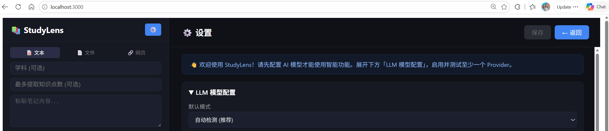
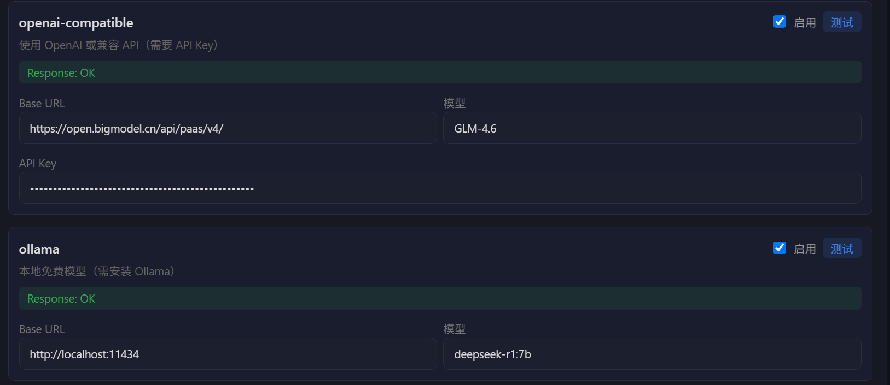

# 快速开始

跟着这三步，几分钟就能让 StudyLens 跑起来。

## 1. 安装并启动

```bash
npm install -g studylens
studylens
```

启动后打开 `http://localhost:3000`。首次启动时，设置面板会自动弹出，引导你完成下一步的 LLM 配置。

> 你的知识库、配置和上传文件统一保存在用户主目录下的 `~/.studylens/`（Windows 为 `C:\Users\你的用户名\.studylens\`）。无论从哪个目录运行 `studylens` 命令，数据都在同一个位置。可通过环境变量 `STUDYLENS_DATA_DIR` 更改。

## 2. 配置大模型（LLM）

StudyLens 的知识提取、问答、专题页生成都依赖一个大模型后端。首次启动时会自动弹出配置引导：



推荐使用 **OpenAI 兼容 API**，填入服务商的 `baseUrl`、`apiKey` 和模型名称即可：



国内可直接选用以下任一服务商：

| 服务商 | baseUrl | 模型示例 | 获取 API Key |
|--------|---------|----------|--------------|
| 智谱 GLM | `https://open.bigmodel.cn/api/paas/v4` | `GLM-4.6` | [模型总览](https://docs.bigmodel.cn/cn/guide/start/model-overview) |
| 通义千问 | `https://dashscope.aliyuncs.com/compatible-mode/v1` | `qwen-plus` / `qwen-max` | [获取 API Key](https://help.aliyun.com/zh/model-studio/get-api-key) |
| DeepSeek | `https://api.deepseek.com` | `deepseek-chat` | [DeepSeek 平台](https://platform.deepseek.com) |
| OpenAI | `https://api.openai.com/v1` | `gpt-4o` | [OpenAI 平台](https://platform.openai.com) |

填好后点击 **测试连接**，成功即可开始使用。

### 想完全本地、免费运行？用 Ollama

无需 API Key 或联网：

1. 安装 [Ollama](https://ollama.com)，拉取并运行一个模型：

   ```bash
   ollama run deepseek-r1:7b
   ```

2. 在设置中启用 `ollama`（默认地址 `http://localhost:11434`，默认模型 `deepseek-r1:7b`）。

### 已是 GitHub Copilot 用户？用 Agent Maestro

> 默认折叠、不启用，需要时再开启。

无需 API Key，复用你已有的 Copilot 订阅：安装 [Agent Maestro](https://marketplace.visualstudio.com/items?itemName=Joouis.agent-maestro) VS Code 扩展，它会在 `http://localhost:23333` 启动本地代理，然后在设置中启用 `agent-maestro` 并测试连接。

> 配置保存在 `config/llm-config.json`（已 gitignore，存放你的 API Key），模板见 `config/llm-config.template.json`。

## 3. 录入第一条知识

配置完成后，在顶部录入面板粘贴一段笔记，点「🤖 AI拆解」让 AI 自动提取结构化知识点；也可以点「+ 手动添加」自己逐条录入。接下来就可以按分类或时间线浏览、深入探索、生成专题页了。

完整功能介绍见 **[用户指南](user-guide.md)**。
